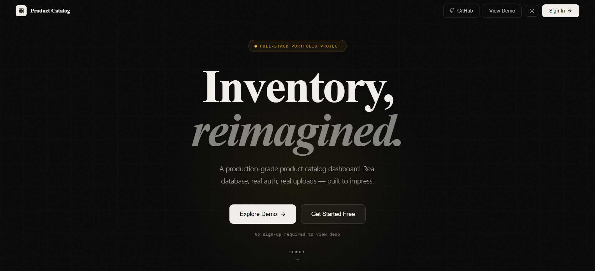
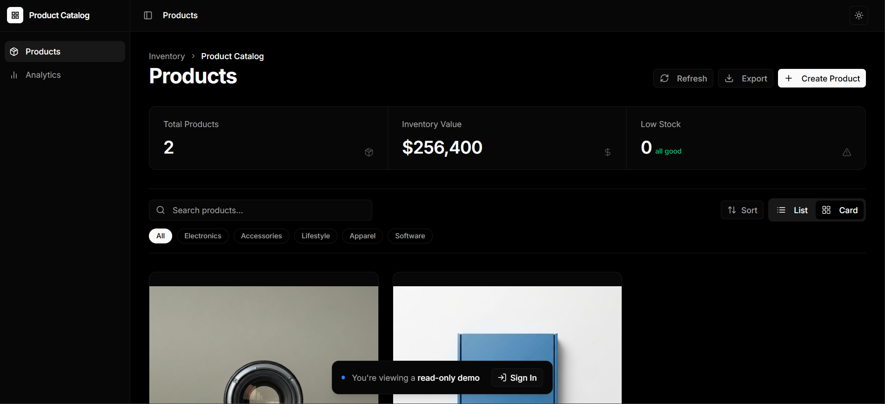
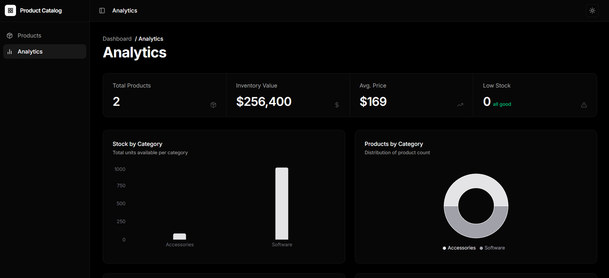

# 📦 Nexventory

A production-grade full-stack inventory and product catalog management platform built with **Next.js 16**, **React 19**, **Supabase**, **Clerk Authentication**, and **Tailwind CSS**.

Designed with a premium modern SaaS aesthetic, Nexventory focuses on real-world inventory workflows including product management, analytics, image uploads, authentication, filtering, and responsive dashboard experiences.

---

# 🚀 Live Demo

👉 https://nexventory-seven.vercel.app/

---

# 📂 GitHub Repository

👉 https://github.com/MsadafK/Nexventory

---

# 🖼️ Project Showcase

<table>
<tr>
<td>

### 📊 Analytics Dashboard



</td>
</tr>

<tr>
<td>

### 📦 Product Management



</td>
</tr>

<tr>
<td>

### 🚀 Landing Page



</td>
</tr>
</table>

---

# ✨ Features

## 🔐 Authentication

- Clerk authentication integration
- Secure sign-in & sign-up
- Session management
- Protected dashboard routes

---

## 📦 Product Management

- Create products
- Edit products
- Delete products
- Product image uploads
- Category management
- Inventory tracking
- Product pricing system

---

## 📊 Analytics Dashboard

- Inventory value calculations
- Product statistics
- Low stock monitoring
- Category distribution charts
- Price distribution analytics
- Real-time dashboard insights

---

## 📤 Cloudinary Upload System

- Cloudinary integration
- Drag-and-drop image uploads
- Live image preview
- Upload progress handling

---

## 🔎 Smart Filtering

- Debounced search
- Category filters
- Sorting functionality
- Optimized product search experience

---

## 📱 Fully Responsive

- Mobile-first responsive design
- Premium dark UI
- Smooth transitions
- SaaS-inspired layout system

---

# 🛠️ Tech Stack

## Frontend

- Next.js 16
- React 19
- Tailwind CSS v4
- shadcn/ui
- Lucide React
- Recharts

---

## Backend & Database

- Supabase
- REST API Routes
- Server-side rendering

---

## Authentication

- Clerk Authentication

---

## Libraries & Utilities

- React Hook Form
- Zod
- Sonner
- clsx
- tailwind-merge
- date-fns

---

# 📂 Project Structure

```bash
📦 Nexventory
├── app
│   ├── analytics
│   ├── api
│   ├── dashboard
│   ├── landing
│   ├── sign-in
│   ├── sign-up
│   └── globals.css
│
├── components
│   ├── ui
│   ├── navbar.jsx
│   ├── sidebar.jsx
│   ├── app-shell.jsx
│   ├── product-form.jsx
│   └── image-upload.jsx
│
├── hooks
│   └── use-debounce.js
│
├── lib
│   ├── supabase.js
│   ├── storage.js
│   ├── categories.js
│   └── utils.ts
│
├── public
│   └── images & assets
│
├── assets
│   └── readme
│       ├── readme-image-1.png
│       ├── readme-image-2.png
│       └── readme-image-3.png
│
└── styles
```

---

# ⚡ Installation & Setup

## 1️⃣ Clone Repository

```bash
git clone https://github.com/MsadafK/Nexventory.git
```

---

## 2️⃣ Navigate Into Project

```bash
cd Nexventory
```

---

## 3️⃣ Install Dependencies

```bash
npm install
```

---

## 4️⃣ Setup Environment Variables

Create a `.env.local` file in the root directory.

```env
NEXT_PUBLIC_SUPABASE_URL=

NEXT_PUBLIC_SUPABASE_ANON_KEY=

NEXT_PUBLIC_CLERK_PUBLISHABLE_KEY=

CLERK_SECRET_KEY=

NEXT_PUBLIC_CLOUDINARY_CLOUD_NAME=

NEXT_PUBLIC_CLOUDINARY_UPLOAD_PRESET=
```

---

## 5️⃣ Run Development Server

```bash
npm run dev
```

---

## 6️⃣ Open In Browser

```bash
http://localhost:3000
```

---

# 📊 Dashboard Capabilities

## Inventory Analytics

- Total inventory value
- Average product pricing
- Product count overview
- Low stock alerts

---

## Charts Included

- Stock by category
- Product distribution
- Inventory value analytics
- Price distribution visualization

---

# 🎨 UI Highlights

- Premium dark mode aesthetic
- Modern SaaS-inspired design
- Elegant typography
- Subtle glassmorphism effects
- Clean grid-based layouts
- Smooth hover interactions

---

# 🔥 Key Learning Outcomes

This project helped improve skills in:

- Full-stack Next.js architecture
- API route handling
- Authentication systems
- Database integration
- Data visualization
- Responsive UI engineering
- Real-world dashboard design
- Form validation
- Cloudinary uploads

---

# 📱 Responsive Experience

Optimized for:

- Desktop
- Tablet
- Mobile devices

---

# 🚀 Future Improvements

- Pagination system
- Role-based access control
- Bulk product import
- Advanced analytics
- Export reports
- AI-powered insights
- Real-time collaboration

---

# 🧠 What Makes Nexventory Different?

Unlike tutorial-level CRUD apps, Nexventory focuses on realistic production-style workflows:

- Authentication
- Analytics
- Real-time dashboards
- Upload handling
- Inventory management
- Data visualization
- Production-grade UI polish
- Scalable component architecture

---

# 👨‍💻 Author

**Mohd Sadaf**
Frontend Developer

* [](https://github.com/MsadafK)
* [](https://www.linkedin.com/in/mohd-sadaf/)

---

# ⭐ If you like this project

Give it a ⭐ on GitHub — it helps a lot!

---

# 📬 Feedback

If you have suggestions or improvements, feel free to open an issue or connect!